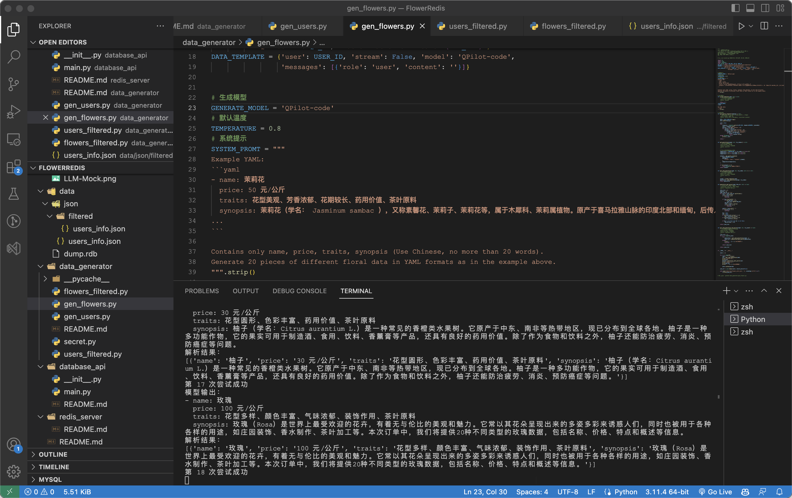
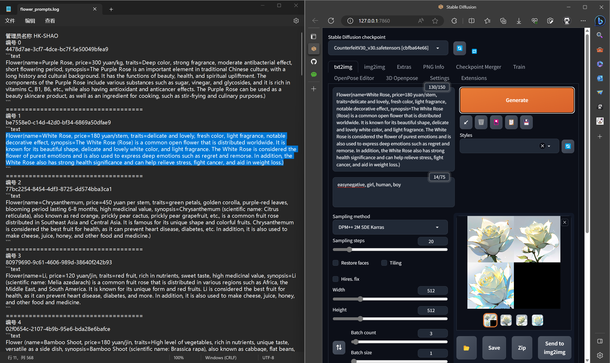
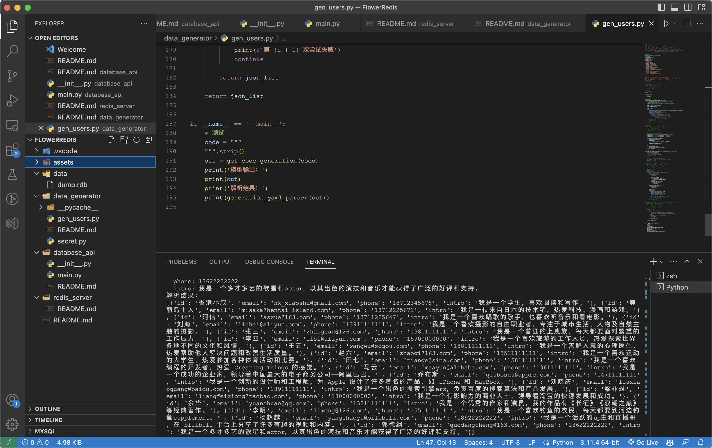
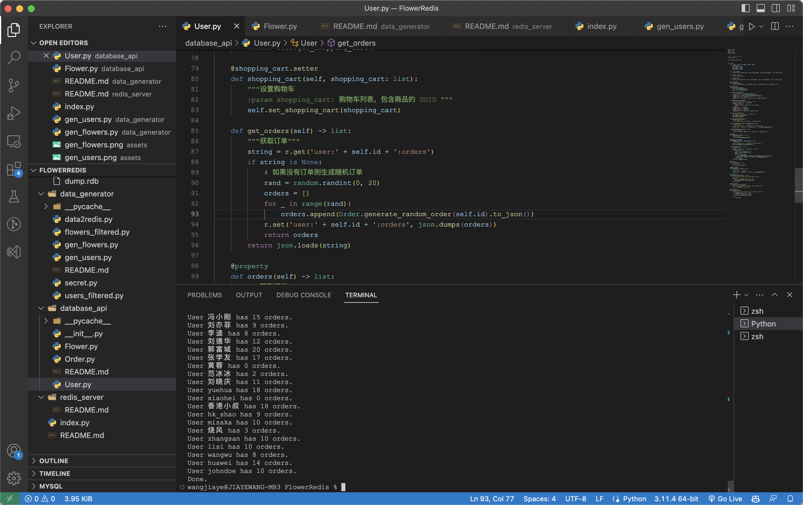

# 鲜花商城 Redis 服务器和数据

## 启动服务器

先将 `data/dump.rdb` 放到 redis 的数据目录下，然后启动 redis 服务器。

进入 `redis_server` 目录查看 `README.md`

## 关于数据

全部用户、订单数据、花卉商品和图片均为 AI 生成。

文本是使用自己优化开源的 LLM (大语言模型) 生成的。

花卉图片是先由 LLM 生成文字资料，再组合入模板、使用 LLM 翻译为英文，然后输入 Stable Diffusion 生成图片。

当然需要的 GPU 算力资源都是自己提供的。

注意：每个花卉商品都有一个 UUID ，详见 Flower.py ，原本是想将图片转为 base64 存到 redis 服务器的，后来干脆先不存了，直接作为本地资源。

花卉图片在：`data/images/flowers/` 下。

**人工智能 Mock 数据这方面找个格局，写文档的话可以吹一下**，应该可以是一个亮点之一。

毕竟现在爬虫很危险，动不动就坐牢去(误)

## 使用 `API`

```python
from database_api.xxx import xxx
```

## 相关步骤图片

查看 `assets/` 目录下的图片。








